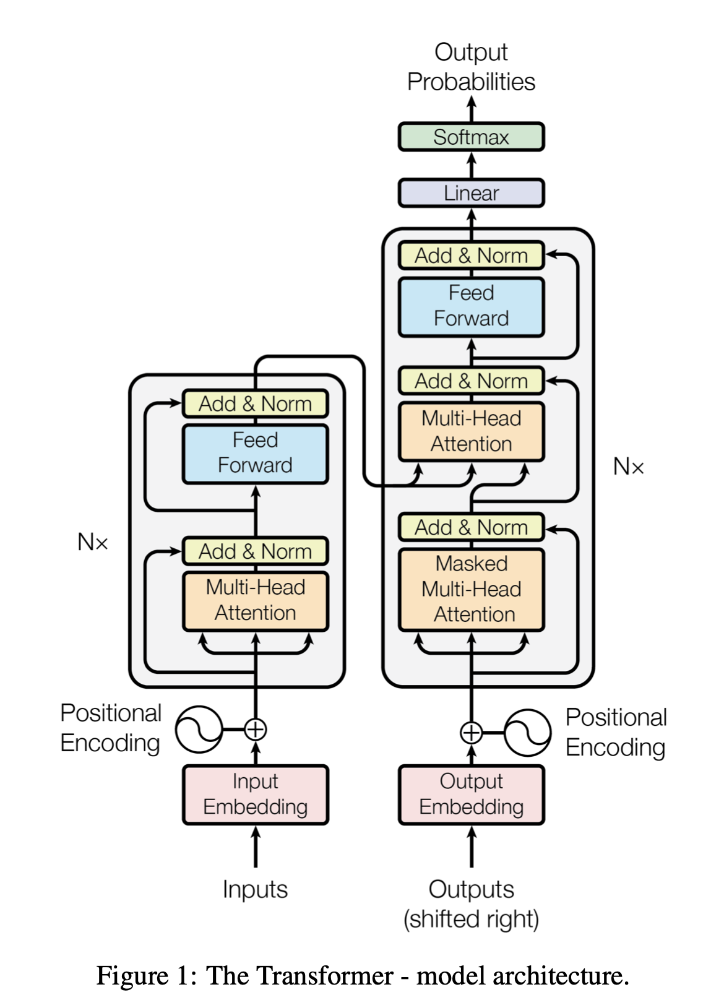

# Chapter 1. 트랜스포머 입문

## Transformer?

- RNN, LSTM의 long-term dependency 문제를 보완한 아키텍쳐.
- Attention 사용 초기에는 RNN, LSTM 기반의 Seq2Seq + Attention 형태로 많이 사용했는데 Transformer는 Self-Attention만을 사용함.
- **Encoder-Decoder** 구조.
    - Encoder: 입력 문장의 표현 방법을 학습
    - Decoder: 표현 방법을 입력받아 원하는 문장을 생성

## Encoder?

- Transformer에서 Encoder는 여러 개를 쌓아서 사용
- Multi-Head Attention과 Feed Forward

### Attention 복습

[https://wikidocs.net/22893](https://wikidocs.net/22893)

Attention(Q, K, V) = Attention value

1. Query에 대해서 모든 Key와의 유사도 계산
2. 유사도를 Key에 매핑된 Value에 반영
3. 적용된 Value를 모두 더하면 -> Attention value

### Self-Attention

- 단어 그대로 Attention을 자기 자신에게 수행한다는 의미
- Q=K=V=입력 문장의 모든 단어 벡터들
- 입력 문장 내의 단어들끼리 유사도를 구함. 각 단어의 표현들은 문장 안에 있는 다른 모든 단어의 표현과 연결해 단어가 문장 내에서 갖는 의미를 이해
- 특정 단어와 문장 내에 있는 모든 단어가 어떤 연관이 있는지를 이해하면 좀 더 좋은 표현을 학습하는데 도움이 됨.
- 무작위 초기화 된 가중치 행렬 W^Q, W^K, W^V을 만들고 입력 행렬 X에 곱해서 Q, K, V를 생성. 가중치 행렬들은 학습 과정에서 업데이트 됨.
- Q와 K의 내적을 구하고 sqrt(d_k)로 나누기 때문에 Scale-dot product attention이라고도 함.
1. 쿼리(Q) 행렬과 키(K^T) 행렬의 내적 연산을 수행
    - Q와 K^T간의 내적을 계산하면 **유사도**를 구할 수 있음
    - 문장의 각 단어가 다른 모든 단어와 얼마나 유사한지 파악하는데 도움을 줌
2. QK^T 행렬을 키 벡터 차원(sqrt(d_k))의 제곱근값으로 나누기
    - 안정적인 경사값을 얻을 수 있음
3. Softmax 함수로 Normalizing
    - 2번까지의 값은 unnormalized form
    - 행 별로 softmax
    - softmax 함수로 normalizing하면 전체 합이 1, 각각의 값은 0~1 사이. 확률값으로 이해가능
    - score matrix: 각각의 단어가 문장 전체의 단어와 얼마나 연관이 있는지 확률로 알 수 있음
4. Attention(Z) 행렬 구하기
    - Normalized Similarity * V
    - Similarity를 Value를 Weight sum!

### Multi-head Attention(MHA)

Attention이 단어 의미 사이의 연관을 잘 찾는다면 좋은 결과가 나오지만, 그렇지 않는다면 문장의 의미가 잘못 해석될 수도 있음. MHA는 여러 개의 Attention을 사용하여 정확한 문장의 의미를 이해하는데 도움을 준다. 구체적인 방법으로는 MHA의 결과로 나온 각각의 Attention vector를 concat하고 새로운 가중치 행렬 W^0를 곱하는 방법을 사용한다. (Attention head의 최종 결과는 Attention head의 원래 크기이므로 크기를 줄이기 위해 W_0을 곱하는 것)

→ 옮긴이의 코멘트에는 “헤드를 여러 개 사용해 어텐션을 사용할 경우 단일 헤드를 사용하는 경우보다 오분류가 일어날 위험을 줄이는 것으로 해석할 수 있다.”라고 되어있는데, Attention 결과의 앙상블 개념으로 생각하면 좋을 것 같습니다.

### Positional Encoding

RNN은 순차적으로 들어가지만 Transformer는 병렬로 들어가기 때문에 구조에서 오는 순서 정보가 없음. 이를 해결하기 위해서 부가적으로 Positional Encoding을 추가해 줌. 논문의 저자들은 다음의 식을 사용함.

(논문 캡쳐)

위치 인코딩 P를 계산 + 임베딩 행렬 X

### Feed Forward Network(FFN)

2개의 Dense + ReLU activation function. Attention 행렬을 입력받아 Encoder 표현을 출력함.

### Add와 Norm

- sublayer에서 MHA의 input과 output을 서로 연결
- sublayer에서 FFN의 input과 output을 서로 연결
- Layer Normalization + Residual Connection
- Layer Normalization: 각 layer의 값이 크게 변화하는 것을 방지해 모델을 더 빠르게 학습할 수 있게 함
- Residual Connection: Vision의 ResNet에서 보던 구조. Skip Connection이라고도 하는데 기존 학습 정보를 보존하고 추가적인 정보만 학습하기 때문에 학습이 쉬워지고, 수렴이 빨라진다. [참고](https://daeun-computer-uneasy.tistory.com/28)

## Decoder?

- Encoder의 결과값을 가져와서 Decoder의 입력값으로 사용하여 타깃을 생성
- Decoder는 **이전 Decoder의 출력**과 **Encoder의 출력**을 입력으로 사용함
    - <sos> + 문장 embedding → 첫 단어 생성
    - <sos> 첫 단어 + 문장 embedding → 첫 단어 두번째 단어 생성
    - <eos>가 나올 때까지 반복
- Decoder의 입력도 Positional Embedding을 더해서 사용

### Masked Multi-head Attention(Masked MHA)

- Decoder에서는 앞에 <sos>를 붙여서 input으로 넣으면, output으로 맨 뒤에 <eos>를 붙여서 결과가 나옴
- 한 단계 shifted된 문장을 출력
- Self-attention은 각 단어의 의미를 이해하기 위해 각 단어와 전체 단어를 연결함.
- Decoder에서는 이전 단계에서 생성한 단어까지만 들어감
- 따라서 각 단어에서 아직 예측되지 않은 오른쪽은 볼 수 없다고 생각 → mask!
- 똑같이 계산하되, softmax 함수에 넣기 전에 -∞으로 mask

### Multi-head Attention

- Decoder의 MHA는 이전 sublayer의 출력(M)과, Encoder의 출력(R)을 입력으로 받음.
- Encoder-Decoder attention layer: Encoder의 결과와 Decoder의 결과 사이의 상호작용이 일어나는 곳
- 행렬 M으로 Q를 만들고, R로 K, V를 생성
    - 일반적으로 Q는 target 문장의 표현을 포함하기 때문에 M에서 가져옴
    - K, V는 입력 문장의 표현을 가져서 R을 참조
    - Q, K, V가 어디서 왔는지를 제외하면 다른 과정들은 Encoder의 MHA와 동일함.

### FFN, add, norm

Encoder와 동일

### Linear, Softmax Layer

- **REMIND: Decoder는 입력 단어들(<sos> + 지금까지 예측한 단어들)을 입력받아서 다음 단어를 예측**
- Linear layer는 마지막 decoder의 최상위 output을 input으로 받아서 vocab 크기와 같은 logit을 출력
- 이 logit을 softmax에 넣어주면 확률값으로 변환 가능
- vocab에서 가장 큰 확률을 가지는 단어를 argmax로 찾아내면 → 그 단어가 예측된 다음 단어

## Transformer 학습

- Decoder가 vocab에 대한 확률 분포를 예측하고 확률이 가장 큰 단어를 선택함
- 실제 확률 분포와 모델이 예측하는 확률 분포의 차이를 줄여나가는 방법으로 학습
- loss function으로 cross-entropy를 사용
- optimizer는 Adam을 사용
- overfitting을 막기 위해 각 sublayer의 output, embedding, positional encoding의 합을 구할 때 Dropout을 적용

## Summary

- Self-attention은 단어를 좀 더 잘 이해하기 위해 주어진 문장의 모든 단어와 해당 단어를 연결
- Query, Key, Value Matrix의 사용
- Positional Encoding
- Encoder - FFN, add, norm
- Decoder - Masked MHA, Encoder-decoder attention, FFN
- Encoder-Decoder가 결합한 상태에서 어떻게 작동하는지

## 연습문제

1. 셀프 어텐션의 전체 단계를 설명하라.
2. 스케일 닷 프로덕트 어텐션을 정의하라.
3. 쿼리, 키, 밸류 행렬은 어떻게 생성하는가?
4. 위치 인코딩이 필요한 이유는 무엇인가?
5. 디코더의 서브레이어에는 무엇이 있는가?
6. 디코더의 인코더-디코더 어텐션 레이어의 입력은 무엇인가?

## Reference

- [Attention Is All You Need paper](https://arxiv.org/pdf/1706.03762.pdf)
- [남수연님 발표자료](https://github.com/dsc-sookmyung/2021-DeepSleep-Paper-Review/blob/main/Week7/Attention%20Is%20All%20You%20Need.pdf)
- [딥 러닝을 이용한 자연어처리 입문](https://wikidocs.net/31379)
