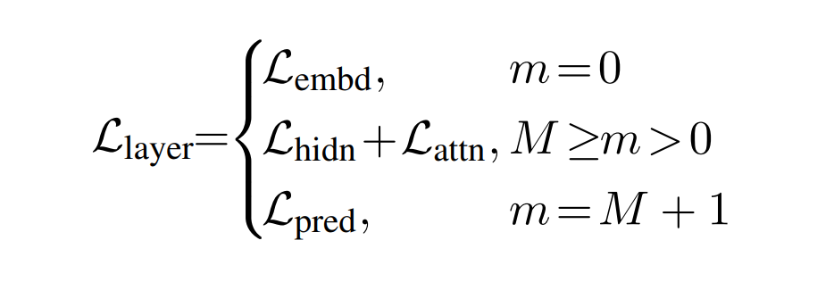

# Chapter 5 BERT 파생 모델 2: 지식 증류 기반

## TinyBERT

- Teacher model의 output layer 말고도 embedding, encoder layers에서 KD
- 중간 layer에서의 지식도 전달
- Student가 Teacher로부터 더 많은 것을 배울 수 있음
- Attention Matrix는 언어 정보를 캡슐화하므로(?) Teacher의 Attention Matrix에서 Student에게 지식을 전달하면 도움이 많이 됨
- 사전학습 뿐만 아니라 fine-tuning에서도 KD
- (Teacher-Student) 아키텍쳐는 동일하지만 layer수가 다름
- Embedding vector size d = 312
- Teacher BERT
  - index 0 - Embedding layer
  - index 1 - 첫번째 encoder layer
  - index n - n번째 encoder layer
  - index n + 1 - prediction layer
- 교사의 n번째 layer에서 학생의 m번째 layer로 지식을 전달

### Transformer layer distillation

- Attention-based Distillation
- Hidden state-based Distillation

### Attention-based Distillation

- Attention Matrix에 대한 지식을 Teacher → Student 이전
- Attention Matrix에는 언어 구문, 상호 참조 정보 등과 같은 정보가 포함됨
- Student attention matrix와 Teacher attention matrix 사이의 MSE를 최소화 해 Student 학습
- L_att = (sum(MSE(A_i^S, A_i^T)) / h
  - h: attention head 수
  - A_i^S: Student BERT의 ith head의 attention matrix
  - A_i^T: Teacher BERT의 ith head의 attention matrix
  - MSE는 Mean Squared Error
- 정규화(Normalization)하지 않은 (Softmax가 없는) Attention Matrix 사용 → 비정규화된 Attention Matrix가 더 좋은 성능을 내고, 수렴 속도도 빠름

### Hidden state-based Distillation

- Hidden state는 기본적으로 Encoder의 출력, representation vector
- H^S와 H^T의 차원이 다를 수 있음
- L_hidden = MSE(H^SW_h, H^T)
- W_h는 학습을 통해 달라지는 값. H^S를 H^T와 같은 공간에 있을 수 있도록 선형변환

### Embedding layer Distillation

- Hidden state와 유사하게 차원이 다를 수 있기 때문에 W_e로 선형 변환
- L_embedding = MSE(E^SW_e, E^T)

### Prediction layer Distillation

- Teacher model에서 생성한 최종 logit으로 학습. DistilBERT와 유사
- Soft target - Soft prediction 사이의 Cross-entropy loss를 minimize
- L_pred = -softmax(Z^T)* log_softmax(Z^S)

### 최종 loss function

## TinyBERT 학습

- General Distillation
- Task-specific Distillation

### General Distillation

- 사전 학습 단계를 의미
- Large BERT를 Teacher로 사용하고 Student model에게 지식을 전달
- 모든 layer에 증류 적용
- 증류 후 Student BERT는 Teacher의 지식으로 구성, 사전 학습된 Student BERT를 General TinyBERT라고 부름
- Downstream task를 위해 General TinyBERT를 Fine-tuning 할 수 있음

### Task-specific Distillation

- Fine-tuning
- 특정 Task를 위해 General TinyBERT를 Fine-tuning
- Teacher model을 먼저 Fine-tuning, 다시 General TinyBERT로 Distillation 진행
- Fine-tuning 단계에서 Distillation을 하려면 더 많은 dataset 필요 → Data Augmentation

### Data Augmentation

Tokenized sentence X의 각각 모든 단어에 대해,

1. X[i]가 단일 단어인지 확인. 단일 단어라면 [MASK] 토큰으로 masking. BERT-base로 masked token을 예측. 확률이 높은 상위 K개의 단어 candidates에 저장
2. X[i]가 단일 단어가 아니면 masking 하지 않음. GloVe Embedding을 사용해 X[i]와 가장 유사한 K 단어 확인하고 candidates에 저장. p~Uniform(0,1)에서 값 p를 무작위로 추출하고, threshold를 p_t = 0.4로 설정
3. p가 p_t보다 작거나 같으면 X_masked[i]를 후보 목록의 임의 단어로 교체
4. p가 p_t보다 크면 교체 안함

- N번 반복하면 N개의 Augmented sentence가 생성
- Augmented Data를 사용하여 General TinyBERT를 Fine-tuning
- TinyBERT는 BERT-base 모델보다,
  - 96%의 추론 효율 향상
  - 7.5배 작음
  - 9.4배 빠름

## BERT에서 신경망으로 지식 전달

- BERT에서 간단한 신경망으로 Distillation이 가능할까?
- Teacher model - Pretrained BERT(여기서는 BERT-large)
  - Teacher model을 Downstream task에 맞게 fine-tuning
- Student model - Bi-LSTM
  - Bi-LSTM은 양방향으로 문장을 읽음
  - 순방향, 역방향 hidden state를 FFN에 넣고 logit 출력
  - softmax → 확률

### Student network training

- 일단 Teacher부터 Fine-tuning
- L = a * L_student + b * L_distillation
- L_distillation = MSE(Z^T, Z^S) → Soft target, Soft prediction에 대한 MSE
- L_student: Hard target, Hard prediction에 대한 cross-entropy
- Teacher BERT에서 Student Network로 KD를 수행하려면 큰 데이터셋 필요
- Task-agnostic Data Augmentation

## Data Augmentation

- Masking
- POS based word replacement
- n-gram sampling

### Masking

- TinyBERT의 DA 방법

### POS based word replacement

- p_pos 확률로 문장의 한 단어를 같은 품사 다른 단어로 대체

### n-gram Sampling

- p_ng 확률로 문장에서 n-gram을 random sampling
- n은 1~5까지 무작위

### Data Augmentation Process

- X_i ~ Uniform(0,1)
- X_i < p_mask이면 w_i 단어를 masking
- p_mask ≤ X_i p_mask + p_pos이면 POS word replacement를 진행
- Masking과 POS based WR은 겹치지 않음. 둘 중 하나만 적용 가능
- 이 단계 이후, p_ng 확률로 n-gram sampling
- N번 수행 → N개의 새로운 Augmented data

문장이 아니라 문장 쌍이라면?

- 문장 1 합성 + 문장 2 유지
- 문장 1 유지 + 문장 2 합성
- 문장 1 합성 + 문장 2 합성

이런 식으로 Augmentation 가능